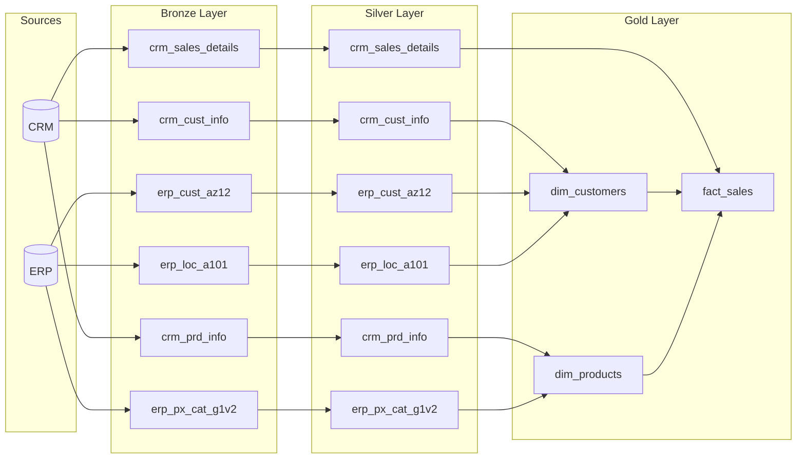

# SQL Data Warehouse (CRM + ERP)

A small SQL Server data warehouse built with the **medallion architecture** (Bronze → Silver → Gold). It ingests raw CRM and ERP CSV extracts, cleans/standardizes them, and exposes an analytics-ready star schema for sales reporting.

## Architecture



- **Bronze** — raw load of CRM (`cust_info`, `prd_info`, `sales_details`) and ERP (`CUST_AZ12`, `LOC_A101`, `PX_CAT_G1V2`) CSVs, no transformations.
- **Silver** — deduplicated, type-corrected, and standardized data (e.g. normalized gender/marital status codes, valid date ranges), with a `dwh_create_date` audit column.
- **Gold** — business-facing views joining Silver tables into a star schema for BI/reporting.

## Gold Layer Schema

```
        gold.dim_customers
               │
               ▼
gold.dim_products ──► gold.fact_sales ◄── gold.dim_customers
```

| View | Type | Key Columns |
|---|---|---|
| `gold.dim_customers` | Dimension | `customer_key` (PK), `customer_id`, `customer_number`, `first_name`, `last_name`, `country`, `gender`, `birthdate` |
| `gold.dim_products` | Dimension | `product_key` (PK), `product_id`, `product_number`, `product_name`, `category`, `subcategory`, `cost` |
| `gold.fact_sales` | Fact | `order_number`, `product_key` (FK), `customer_key` (FK), `order_date`, `sales_amount`, `quantity`, `price` |

## Project Structure

```
scripts/
├── init_database.sql           # creates DataWarehouse db + bronze/silver/gold schemas
├── bronze/
│   ├── ddl_bronze.sql           # raw table definitions
│   └── proc_load_bronze.sql     # bulk-loads CSVs into bronze
├── silver/
│   ├── ddl_silver.sql           # cleaned table definitions
│   ├── proc_load_silver.sql     # transform + load bronze → silver
│   └── silver_testing.sql       # data quality checks
├── gold/
│   └── ddl_gold.sql             # star schema views (dims + fact)
└── execute.sql                  # run the full pipeline
source_crm/                      # raw CRM CSV extracts
source_erp/                      # raw ERP CSV extracts
```

## How to Run

1. Run `scripts/init_database.sql` to create the `DataWarehouse` database and schemas.
2. Run `scripts/bronze/ddl_bronze.sql` then `scripts/bronze/proc_load_bronze.sql`, and execute `EXEC bronze.load_bronze;`.
3. Run `scripts/silver/ddl_silver.sql` then `scripts/silver/proc_load_silver.sql`, and execute `EXEC silver.load_silver;`.
4. Run `scripts/gold/ddl_gold.sql` to create the reporting views.

## Tech Stack

SQL Server (T-SQL), CSV file ingestion (`BULK INSERT`).
